# Bayer-interpolation
Bayer interpolation using OpenMP

## Introduction

* Read raw file 8bit to 10bit
* Bayer interpolation
* Use OpenMP with section and for loop
* QT GUI

## Bayer interpolation
### Do padding
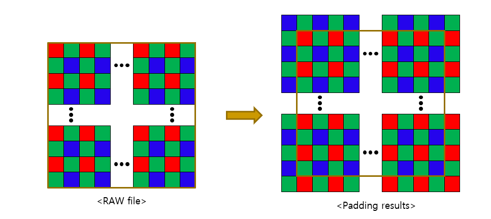

### Do interpolation(R)
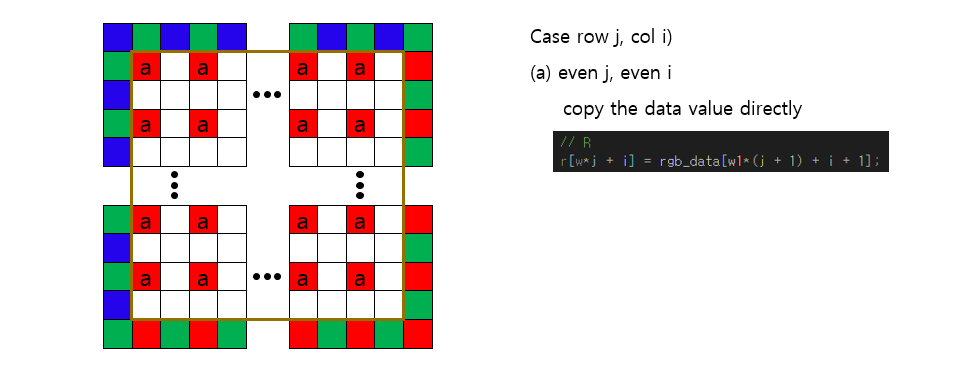
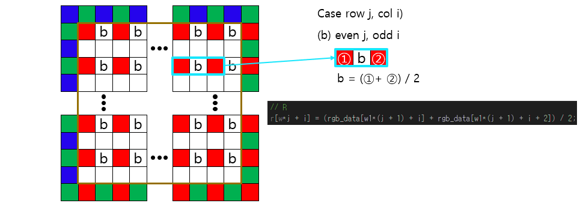
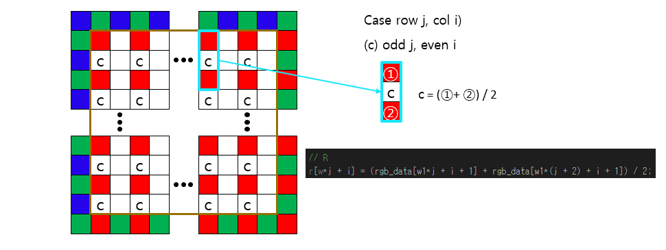
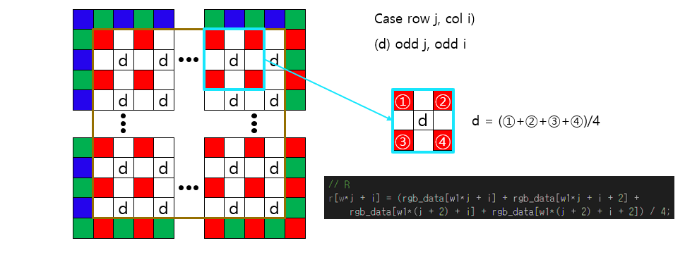

### Do interpolation(G)
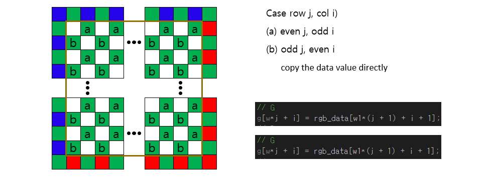
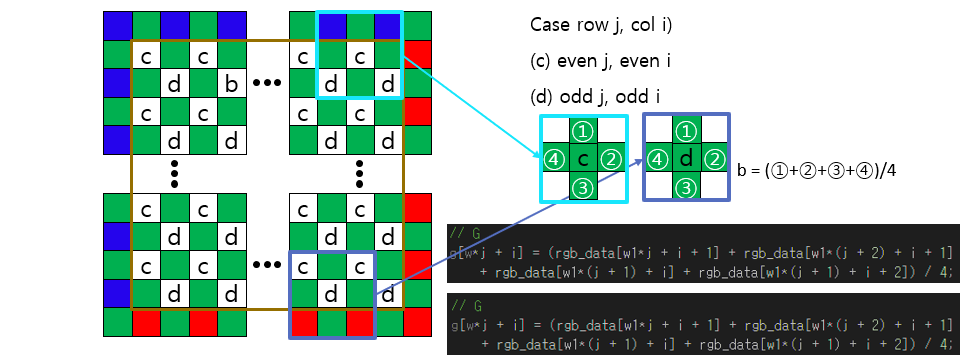

### Do interpolation(B)
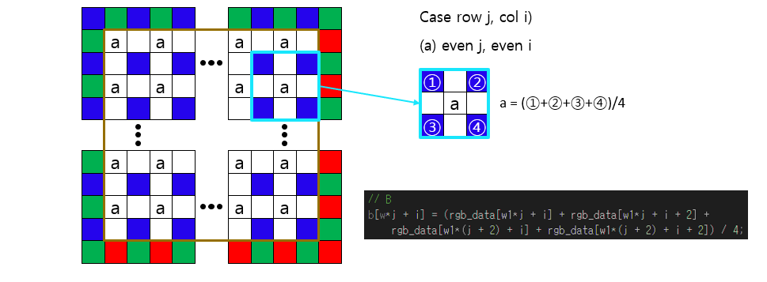
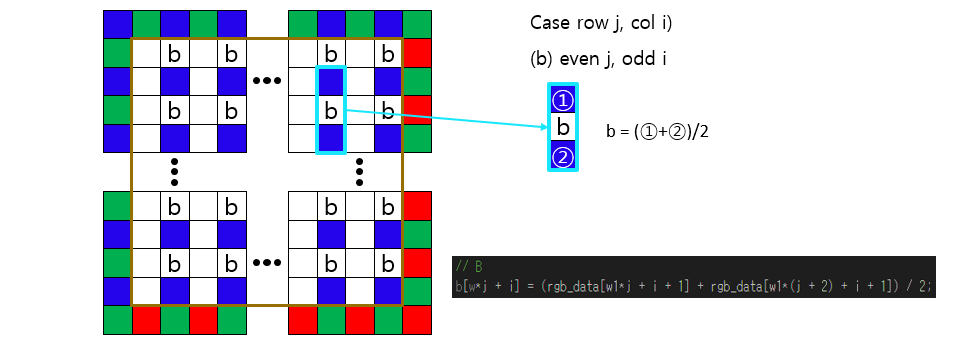
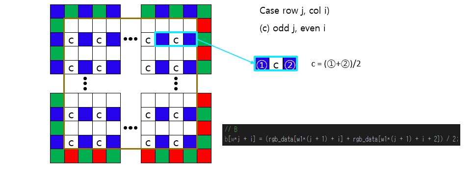
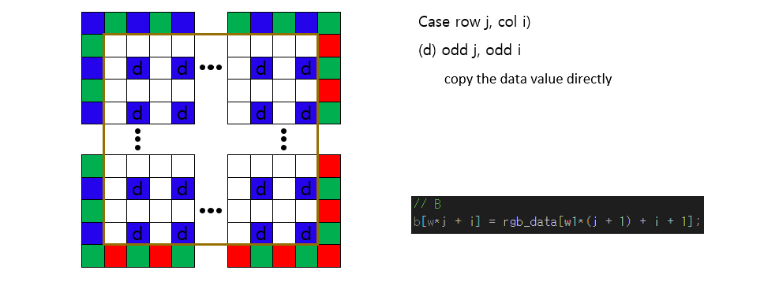

## GUI-QT
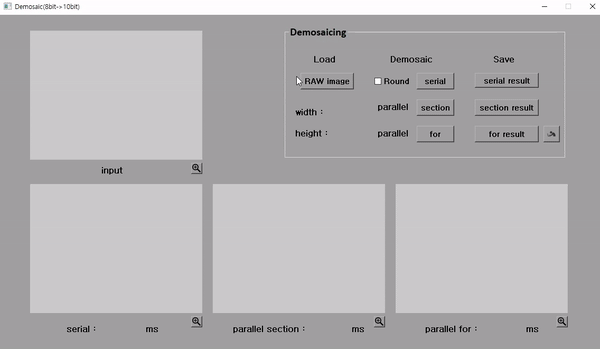
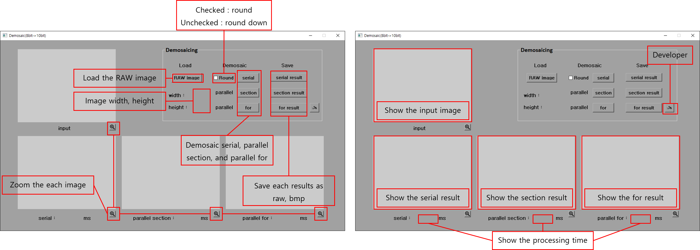

## Results
Image : raw.RAW, size : 3264*2448, number of thread : 4
* round down

|                      | test1 | test2 | test3 | test4 | test5 | Average |
|----------------------|-------|-------|-------|-------|-------|---------|
| Serial(msec)         |52.0050|55.2474|58.5395|57.2948|54.7493|55.5672|
| OpenMP section(msec) |38.9248|48.5108|34.2315|43.9763|36.3111|39.7909|
| OpenMP for(msec)     |12.3765|16.9358|11.6713|13.9790|12.9217|__13.5768__|

* round

|                      | test1 | test2 | test3 | test4 | test5 | Average |
|----------------------|-------|-------|-------|-------|-------|---------|
| Serial(msec)         |403.163|369.175|376.107|379.729|383.336|382.302|
| OpenMP section(msec) |222.628|245.456|248.673|236.584|249.586|240.585|
| OpenMP for(msec)     |112.283|105.218|106.772|84.2698|102.607|__102.229__|
